# Predator Panic

## 게임 설명

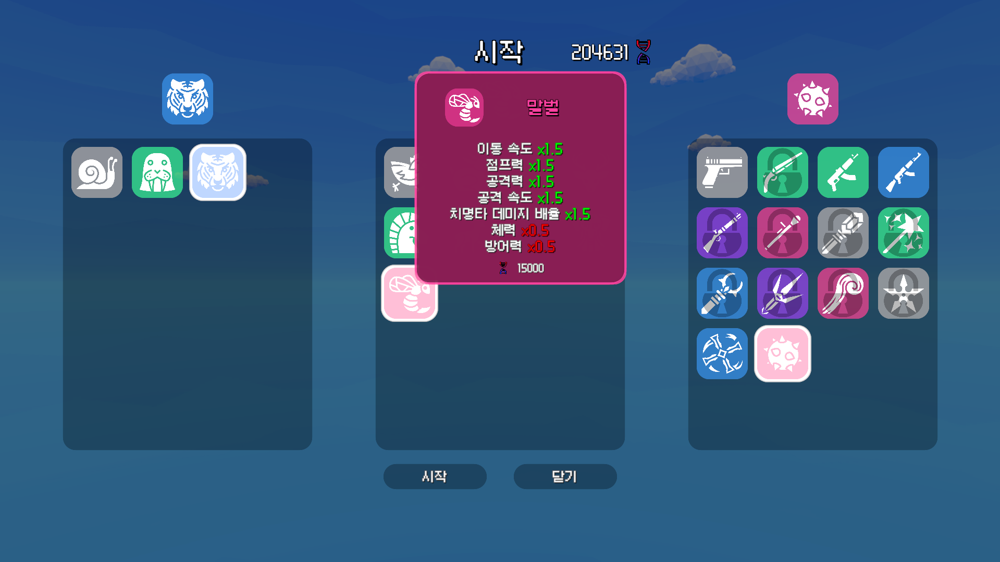

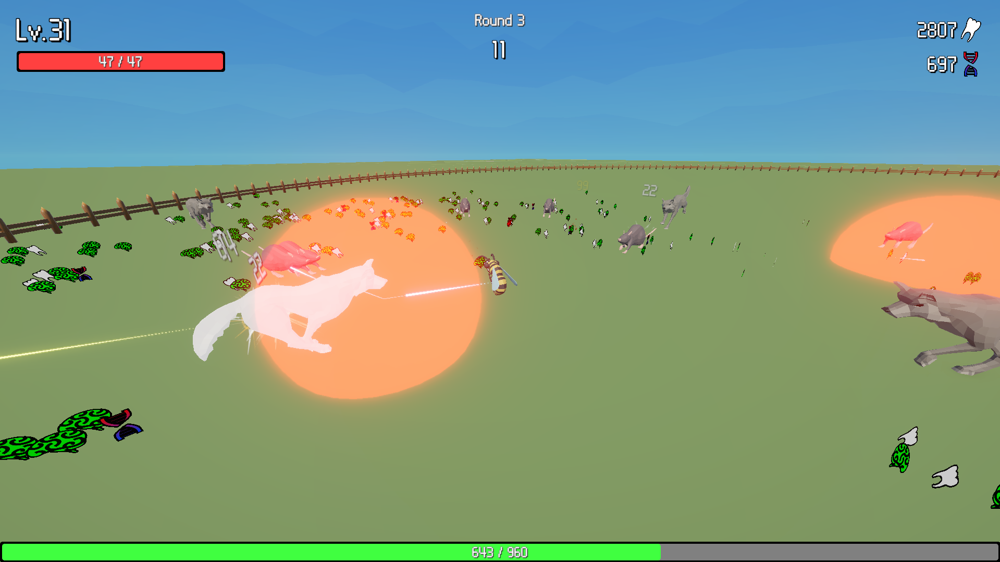

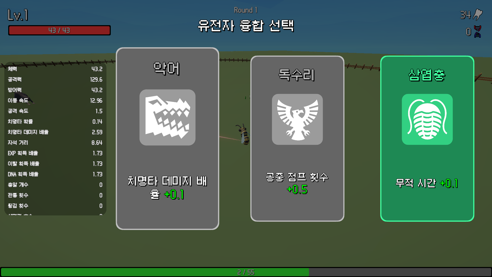

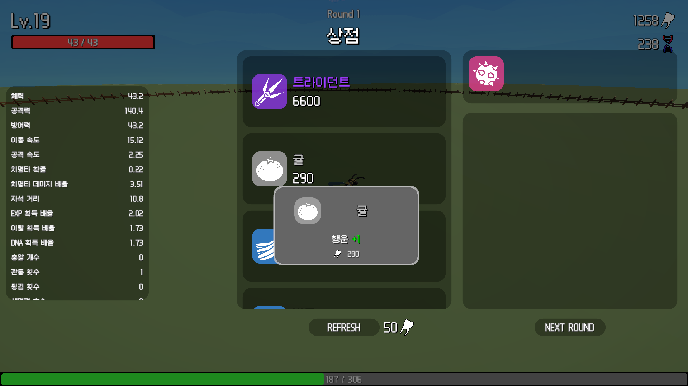

Predator Panic은 주어진 공간 내에서 다가오는 육식 동물들을 피하거나 사냥하면서 주어진 시간을 버텨내고, 레벨 업과 상점을 통해 강해지는 뱀파이어 서바이벌 라이크 게임입니다.

---

## 플레이 영상
[](https://youtu.be/olaylQ57qC4?t=0s)

---

## 게임 진행 순서

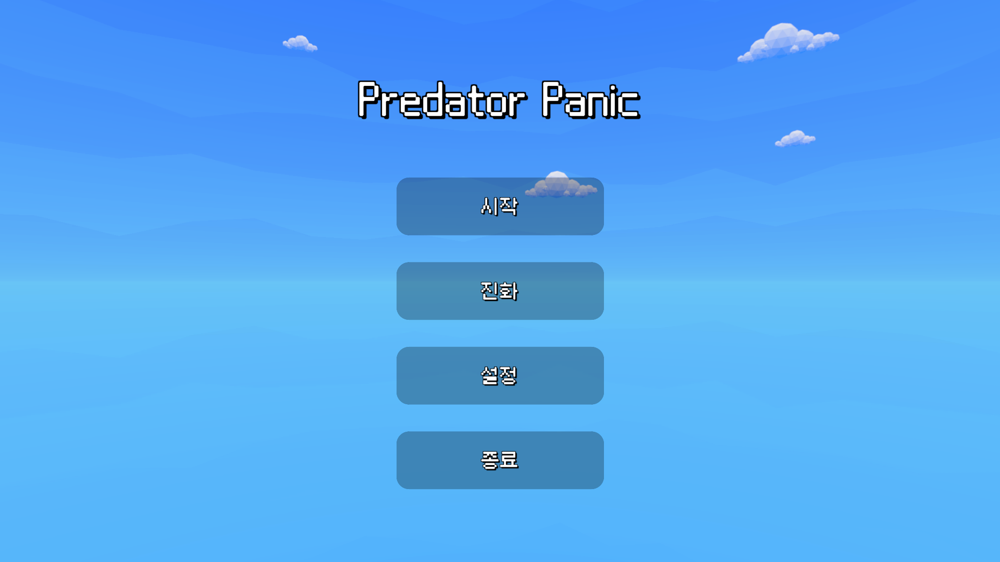

게임 시작 시 보이는 메인 메뉴 화면입니다. 메인 메뉴에서는 시작, 진화, 설정, 종료가 선택 가능합니다. 진화는 재화를 통해서 플레이어가 업그레이드를 진행할 수 있는 기능입니다.

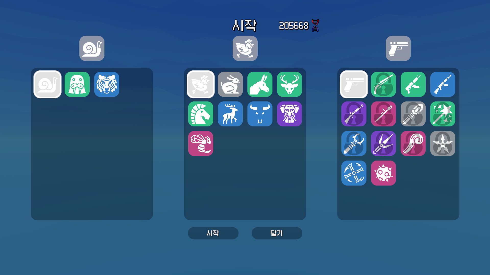

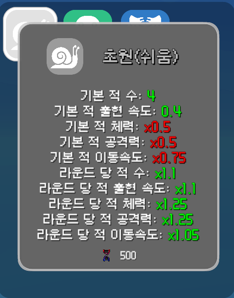

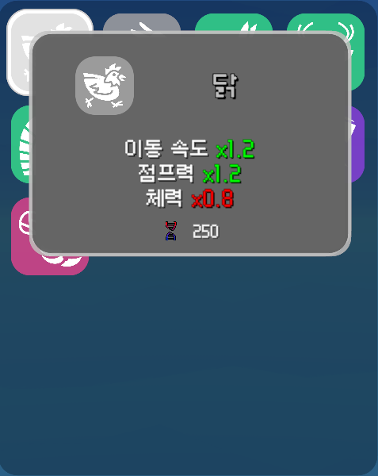

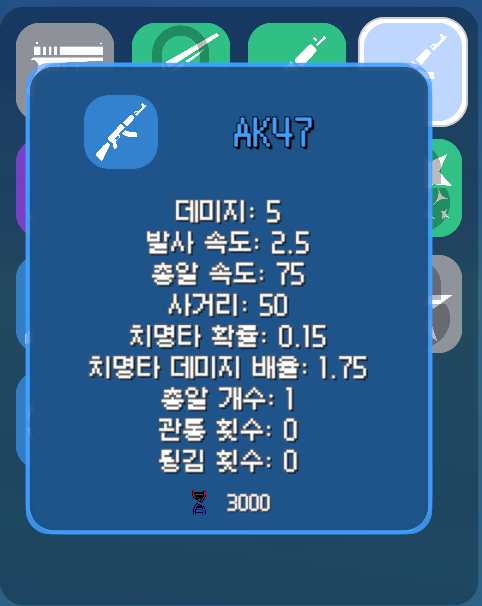

시작 화면에서는 스테이지와 난이도, 플레이 캐릭터, 시작 무기를 고를 수 있습니다. 게임에서 획득할 수 있는 재화를 통해 다양한 것들을 해금할 수 있습니다. 이후 시작 버튼을 눌러 게임을 시작할 수 있습니다.

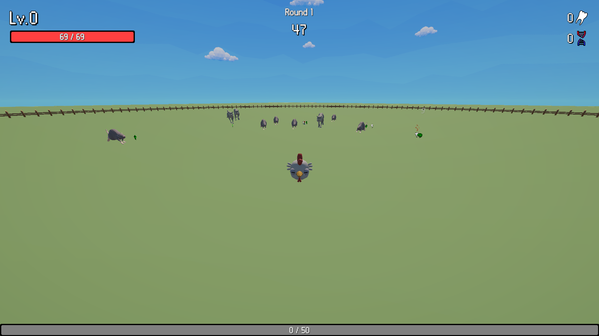

게임을 시작하면 울타리에 원형으로 둘러싸인 장소로 이동합니다. 플레이어 주위에서는 적 몬스터가 계속해서 생성되며 이 적들에게 닿으면 체력을 잃게 됩니다.

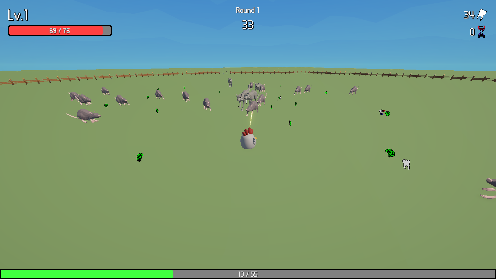

플레이어는 여러 무기를 들 수 있습니다. 이 무기 사거리 안에 적이 들어왔을 때 자동으로 가장 가까운 적을 공격하게 됩니다. 적의 체력이 0 이하가 되면 그에 따른 드랍 아이템을 드랍한 뒤 사라집니다. 드랍 아이템을 경험치, 체력, 일시적인 재화, 영구적인 재화를 얻을 수 있습니다.

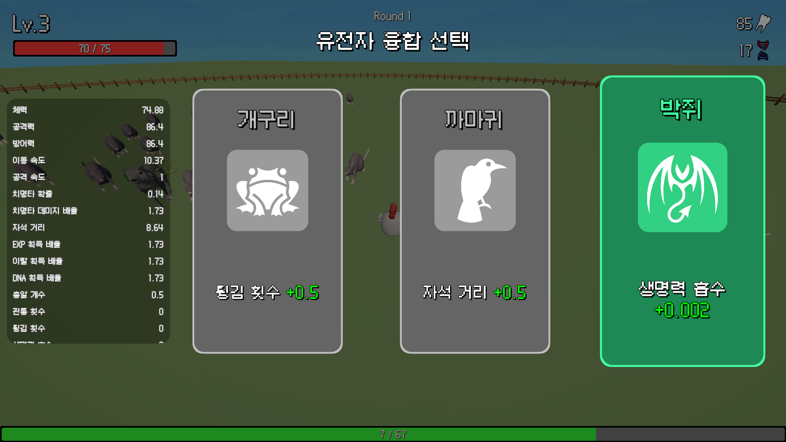

레벨 업을 하게 되면 유전자 융합 선택 창이 나오며 세 가지 업그레이드 중 하나를 선택할 수 있습니다. 업그레이드를 통해서 플레이어의 여러 스탯 중 하나를 업그레이드 할 수 있습니다. 좌측에는 현재 스탯이 나와 있습니다.

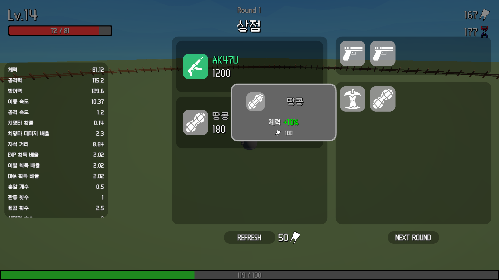

라운드의 제한 시간동안 살아남으면 모든 적들을 없애고 모든 드랍 아이템을 획득한 후 상점으로 진입합니다. 상점에서는 일시적인 재화인 이빨을 통해서 무기, 아이템을 구매하거나 판매할 수 있습니다.

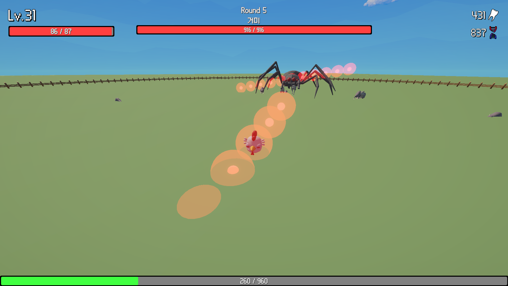

5라운드마다 보스가 나옵니다. 보스는 크기와 체력이 더 크며 플레이어를 따라오기만 하는 것이 아니라 공격을 하기도 합니다. 보스 라운드에서는 보스를 처치하면 더 큰 보상을 얻을 수 있지만 보스 이외의 적에게서 아이템을 얻을 수 없습니다.


플레이어의 체력이 0이 되면 게임 오버가 됩니다. 게임에서 획득한 영구 재화를 통해 업그레이드를 하고 다시 도전할 수 있습니다.

---

## 주요 기능 소개

### 스탯 시스템

플레이어에게는 다양한 스탯이 존재합니다. 여러가지 캐릭터가 각기 다른 스탯을 가지고 있으며 게임 내에서 레벨 업을 통한 강화, 상점에서 구입하는 아이템, 그리고 진화 시스템을 통해 이런 스탯들을 변동시킬 수 있습니다.

- PlayerStatType
    
    ```csharp
    /// <summary>
    /// 플레이어 스탯 타입
    /// </summary>
    public enum PlayerStatType
    {
        Health, //최대 체력
        Attack, //공격력
        Defense, //방어력
        MoveSpeed, //이동 속도
        AttackSpeed, //공격 속도
        CriticalRate, //치명타 확률
        CriticalDamageRate, //치명타 피해량
        MagnetRadius, //자석 반경
        EXPGainRate, //경험치 획득률
        ToothGainRate, //이빨 획득률
        DNAGainRate, //DNA 획득률
        BulletCount, //발사 탄환 수
        PenetrationCount, //탄환 관통 수
        RicochetCount, //탄환 튕김 수
        LifeSteal, //생명력 흡수
        JumpForce, //점프력
        AirJumpCount, //공중 점프 횟수
        InvincibleDuration, //피격 무적 시간
        Luck, //행운
        BulletSpeed, //탄환 속도
    }
    ```
    

이러한 스탯 변동에는 단순한 더하기, 빼기도 있지만 비율 연산과 배율 연산도 들어갈 수 있습니다. 그리고 이런 변동이 발생할 때마다 현재 값에 대해서 바로 적용하는 것은 의도와 다르게 동작할 가능성이 있습니다.

예를 들어 현재 공격력이 100이고 공격력을 10% 높이는 아이템을 장착하면 110이 됩니다. 이 아이템을 해제했을 때 단순히 10%를 빼주는연산을 하게 되면 공격력이 99가 됩니다.

위와같은 문제점을 막기 위해 스탯 시스템을 구상했습니다. Stat은 기본값인 BaseValue과 스탯 변동을 적용한 최종값인 FinalValue를 가지고 있습니다. 이러한 스탯 변동들은 StatModifier 클래스로 정의하고 Stat 내부에 List로 저장해둡니다. 그리고 스탯 변동이 추가, 제거될 때마다 최종값을 새롭게 계산합니다.

StatModifier에는 스탯 변동 값, 변동 타입, 출처가 존재합니다. 변동 타입은 FlatAdd, PercentAdd, PercentMult로 나뉘어 다양한 스탯 변동을 가능하게 합니다. 출처에는 아이템 등의 객체를 지정하여 아이템을 해제할 때 해당 StatModifier를 한꺼번에 제거할 수 있도록 했습니다.

- Stat
    
    ```csharp
    /// <summary>
    /// 스탯 클래스
    /// 기본 값과 스탯 모디파이어 리스트를 보유
    /// 값 변경 시 이벤트 발생
    /// </summary>
    public class Stat
    {
        //초기값
        public float BaseValue { get; private set; }
        //최종값
        public float FinalValue { get; private set; }
        //스탯 모디파이어 리스트
        private readonly List<StatModifier> _statModifiers;
        //값 변경 이벤트
        public event Action<float> OnValueChanged;
    
        public Stat(float baseValue)
        {
            BaseValue = baseValue;
            _statModifiers = new();
            CalculateFinalValue();
        }
    
        /// <summary>
        /// 스탯 모디파이어 추가
        /// </summary>
        public void AddModifier(StatModifier mod)
        {
            _statModifiers.Add(mod);
            CalculateFinalValue();
        }
    
        /// <summary>
        /// 스탯 모디파이어 제거
        /// </summary>
        public bool RemoveModifier(StatModifier mod)
        {
            if (_statModifiers.Remove(mod))
            {
                CalculateFinalValue();
                return true;
            }
            return false;
        }
    
        /// <summary>
        /// 소스에 해당하는 모든 스탯 모디파이어 제거
        /// </summary>
        public bool RemoveAllModifiersFromSource(object source)
        {
            int numRemoved = _statModifiers.RemoveAll(mod => mod.Source == source);
            if (numRemoved > 0)
            {
                CalculateFinalValue();
                return true;
            }
            return false;
        }
    
        private void CalculateFinalValue()
        {
            float finalFlat = 0f;
            float finalPercentAdd = 0f;
            float finalPercentMult = 1f;
    
            // 적용 순서: Flat -> PercentAdd -> PercentMult
            foreach (var mod in _statModifiers)
            {
                switch (mod.Type)
                {
                    case StatModifierType.Flat:
                        finalFlat += mod.Value;
                        break;
                    case StatModifierType.PercentAdd:
                        finalPercentAdd += mod.Value;
                        break;
                    case StatModifierType.PercentMult:
                        finalPercentMult *= mod.Value;
                        break;
                }
            }
    
            FinalValue = BaseValue + finalFlat;
            FinalValue *= 1 + finalPercentAdd;
            FinalValue *= finalPercentMult;
    
            FinalValue = Mathf.Max(0, FinalValue); // 음수 방지
    
            OnValueChanged?.Invoke(FinalValue);
        }
    }
    ```
    
- StatModifier
    
    ```csharp
    /// <summary>
    /// 스탯 모디파이어 클래스
    /// 스탯에 추가되어 최종값에 영향을 미침
    /// 값, 타입, 출처 포함
    /// </summary>
    public class StatModifier
    {
        public float Value { get; private set; }
        public StatModifierType Type { get; private set; }
        public object Source { get; private set; }
    
        public StatModifier(float value, StatModifierType type, object source)
        {
            Value = value;
            Type = type;
            Source = source;
        }
    }
    ```
    

### 효과 시스템

플레이어가 소환될 때 미리 정해진 기본 스탯 값에 따라서 스탯들이 초기화됩니다. 이후 아이템이나 진화 등에 의해서 스탯의 값들을 변화시킬 수 있습니다. 이러한 효과들을 ScriptableObject를 활용해서 유지보수 및 새로운 효과를 추가하기 쉽도록 했습니다.

EffectData는 모든 효과 데이터의 기본이 되는 추상 클래스입니다. 그리고 각각의 데이터와 쌍을 이루는 Effect 클래스가 존재합니다. EffectData는 효과에 대한 데이터를 정의하고 Effect는 그 효과를 런타임에 적용하는 것을 담당합니다. EffectData를 통해 Effect를 획득할 수 있도록 함수도 만들어 두었습니다.

이렇게 런타임용 클래스를 따로 나눔으로써 아래와 같은 이점을 얻을 수 있습니다.

1. 같은 효과를 여러 개 적용하고, 그중 하나를 선택해서 제거할 수 있다.
2. 효과 내부에서 런타임에 필요한 변수들을 각각 지정해줄 수 있다.
- EffectData
    
    ```csharp
    /// <summary>
    /// 효과 데이터 클래스
    /// </summary>
    public abstract class EffectData : ScriptableObject
    {
        [Header("Basic Info")]
        [field: SerializeField, TextArea] public string Description { get; private set; }
    
        /// <summary>
        /// 효과 생성 메서드
        /// </summary>
        public abstract Effect GetEffect();
    
        /// <summary>
        /// 효과 설명 반환 메서드
        /// </summary>
        public virtual string GetDescription()
        {
            return Description;
        }
    }
    ```
    
- Effect
    
    ```csharp
    /// <summary>
    /// 효과 클래스
    /// 런타임에 플레이어에게 적용되는 실제 효과들을 정의
    /// </summary>
    public abstract class Effect
    {
        public EffectData EffectData { get; private set; }
    
        public Effect(EffectData effectData)
        {
            EffectData = effectData;
        }
    
        /// <summary>
        /// 효과 적용 메서드
        /// </summary>
        public abstract void Apply(Player player);
    
        /// <summary>
        /// 효과 제거 메서드
        /// </summary>
        public abstract void Remove(Player player);
    
        /// <summary>
        /// 효과 설명 반환 메서드
        /// 기본적으로 데이터의 설명을 그대로 반환합니다.
        /// 런타임에 동적으로 변경된 설명이 필요한 경우 오버라이드합니다.
        /// </summary>
        public virtual string GetDescription()
        {
            return EffectData.GetDescription();
        }
    }
    ```
    

예를 들어 위에서 만든 스탯 시스템을 활용해서 플레이어에게 스탯 버프를 주는 효과를 만들 수 있습니다. StatBuffEffectData는 EffectData를 상속하여 스탯 버프에 필요한 데이터들을 정의합니다. StatBuffEffect는 Effect 클래스를 상속하여 실제 플레이어에게 스탯 버프를 적용하는 역할을 담당합니다. 효과가 제거될 때 스탯 버프를 제거하는 역할도 담당합니다. 런타임용 클래스를 따로 만들어 각 효과마다 객체를 따로 설정했기 때문에 스탯 버프가 여러 개 있어도 해당 효과로 인한 스탯 버프만 제거할 수 있습니다.

- StatBuffEffectData
    
    ```csharp
    using UnityEngine;
    
    /// <summary>
    /// 스탯 버프 효과 데이터 클래스
    /// </summary>
    [CreateAssetMenu(fileName = "StatBuffEffectData", menuName = "SO/Effect/StatBuffEffectData", order = 0)]
    public class StatBuffEffectData : EffectData
    {
        [Header("Stat Buff Info")]
        [field: SerializeField] public PlayerStatType StatType { get; private set; }
        [field: SerializeField] public StatModifierType ModifierType { get; private set; }
        [field: SerializeField] public float BuffAmount { get; private set; }
    
        public override Effect GetEffect()
        {
            return new StatBuffEffect(this);
        }
    
        override public string GetDescription()
        {
            //목표 스탯 이름 가져오기
            var statData = DataManager.Instance.PlayerStatTypeDataList.GetData(StatType);
    
            //설명 반환
            return $"{statData.StatName} {StringUtility.GetModifierDescription(ModifierType, BuffAmount)}";
        }
    }
    ```
    
- StatBuffEffect
    
    ```csharp
    /// <summary>
    /// 스탯 버프 효과 클래스
    /// </summary>
    public class StatBuffEffect : Effect
    {
        //데이터 저장
        private StatBuffEffectData _data;
    
        public StatBuffEffect(EffectData effectData) : base(effectData)
        {
            _data = effectData as StatBuffEffectData;
        }
    
        public override void Apply(Player player)
        {
            //목표 스탯
            var stat = player.PlayerStats.GetStat(_data.StatType);
    
            //스탯 모디파이어 추가
            stat.AddModifier(new StatModifier(_data.BuffAmount, _data.ModifierType, this));
        }
    
        public override void Remove(Player player)
        {
            //목표 스탯
            var stat = player.PlayerStats.GetStat(_data.StatType);
    
            //스탯 모디파이어 제거
            stat.RemoveAllModifiersFromSource(this);
        }
    }
    ```
    

이렇게 만들어진 효과 시스템은 아이템의 데이터인 ItemData 클래스, 진화 데이터인 EvolutionData 클래스에서 활용됩니다. 각각의 효과들이 플레이어에게 추가되거나 제거되는 방식입니다.

- ItemData
    
    ```csharp
    [CreateAssetMenu(fileName = "ItemData", menuName = "SO/Item/ItemData", order = 0)]
    public class ItemData : ScriptableObject
    {
        [Header("Basic Info")]
        [SerializeField] private string _itemName;
        [SerializeField] private Sprite _icon;
        [SerializeField] private Rarity _rarity;
        [SerializeField] private int _basePrice;
        public string ItemName => _itemName;
        public Sprite Icon => _icon;
        public Rarity Rarity => _rarity;
        public int BasePrice => _basePrice;
    
        [Header("Item Effect Data")]
        [SerializeField] private List<EffectData> _effectDatas;
        public List<EffectData> EffectDatas => _effectDatas;
    
        //설명 반환
        public string GetDescription()
        {
            List<string> descriptions = new();
            foreach (var effectData in _effectDatas)
            {
                descriptions.Add(effectData.GetDescription());
            }
            return string.Join("\n", descriptions);
        }
    }
    ```
    
- EvolutionData
    
    ```csharp
    /// <summary>
    /// 진화 데이터 스크립터블 오브젝트
    /// 플레이어가 영구적으로 획득한 효과들을 정의합니다
    /// </summary>
    [CreateAssetMenu(fileName = "EvolutionData", menuName = "SO/Evolution/EvolutionData", order = 0)]
    public class EvolutionData : ScriptableObject, IBasicData
    {
        [Header("Basic Data")]
        [SerializeField] private string _id;
        [SerializeField] private string _name;
        [SerializeField] private string _description;
        [SerializeField] private Sprite _icon;
        [SerializeField] private Rarity _rarity;
        [SerializeField] private int _basePrice = 200;
        [SerializeField] private float _priceIncreaseRate = 1.5f;
        public string ID => _id;
        public string Name => _name;
        public string Description => _description;
        public Sprite Icon => _icon;
        public Rarity Rarity => _rarity;
        public int BasePrice => _basePrice;
        public float PriceIncreaseRate => _priceIncreaseRate;
    
        [Header("Effect Data List")]
        [SerializeField] private List<EvolutionLevelEffets> _leveleffects = new();
        public List<EvolutionLevelEffets> LevelEffects => _leveleffects;
        public int MaxLevel => _leveleffects.Count;
    
        public List<EffectData> GetEffectsByLevel(int level)
        {
            //레벨 유효성 검사
            if (level < 1 || level > MaxLevel) return new();
    
            //해당 레벨의 이펙트들 반환
            return _leveleffects[level - 1].Effects;
        }
    
        public string GetDescriptionByLevel(int level)
        {
            //레벨 유효성 검사
            if (level < 1 || level > MaxLevel) return "";
    
            //해당 레벨의 이펙트들 가져오기
            var effects = _leveleffects[level - 1].Effects;
    
            // 스트링 리스트 생성
            List<string> effectDescriptions = new();
    
            // 각 이펙트의 설명을 리스트에 추가
            foreach (var effect in effects)
            {
                effectDescriptions.Add(effect.GetDescription());
            }
    
            // 리스트의 설명들을 개행 문자로 구분하여 하나의 문자열로 반환
            return string.Join("\n", effectDescriptions);
        }
    
        public int GetPriceForLevel(int level)
        {
            //레벨 유효성 검사
            if (level < 1 || level > MaxLevel) return 0;
    
            //가격 계산
            return Mathf.FloorToInt(_basePrice * Mathf.Pow(_priceIncreaseRate, level - 1));
        }
    }
    ```
    

### FSM

게임 진행과 플레이어의 움직임에 FSM을 활용했습니다. 각 상태에 따라 클래스를 나누고 그 안에서 로직을 작성하는 것으로 코드의 복잡도를 줄이고 상태의 추가, 변경 등을 수월하게 만들기 위함입니다. 각각의 FSM 클래스들을 작성하기 위해서 먼저 IState 인터페이스와 StateMachine 클래스를 작성했습니다.

- IState
    
    ```csharp
    /// <summary>
    /// 상태 기계에서 사용하는 상태 인터페이스
    /// </summary>
    public interface IState
    {
        void Enter();
        void Update();
        void Exit();
    }
    ```
    
- StateMachine
    
    ```csharp
    /// <summary>
    /// 상태 기계 클래스
    /// </summary>
    public class StateMachine
    {
        public IState CurrentState { get; private set; }
    
        public void ChangeState(IState nextState)
        {
            CurrentState?.Exit();
            CurrentState = nextState;
            CurrentState?.Enter();
        }
    
        public void Update()
        {
            CurrentState?.Update();
        }
    }
    ```
    

먼저 게임 상태 제어를 위한 FSM 입니다. 게임 진행을 위한 상태들을 정의하기 위해서 먼저 기본이 될 추상 클래스인 GameBaseState 클래스를 작성했습니다. IState 인터페이스를 상속하여 StateMachine에서 사용할 수 있도록 했습니다.

GameManager와 GameStateFactory를 생성자에서 입력으로 받아 상태 클래스 내부에서 게임 로직에 관여하거나 상태를 변경할 수 있도록 했습니다.

- GameBaseState
    
    ```csharp
    /// <summary>
    /// 게임 상태를 위한 베이스 상태 클래스
    /// </summary>
    public abstract class GameBaseState : IState
    {
        protected GameManager GameManager { get; private set; }
        protected GameStateFactory Factory { get; private set; }
    
        public GameBaseState(GameManager gameManager, GameStateFactory factory)
        {
            GameManager = gameManager;
            Factory = factory;
        }
    
        public abstract void Enter();
        public abstract void Update();
        public abstract void Exit();
        public virtual void InitSubStates() { }
    
        protected void ChangeState(GameBaseState newState)
        {
            GameManager.StateMachine.ChangeState(newState);
        }
    }
    ```
    

GameStateFactory는 각 상태 클래스를 캐싱해두고 제공하는 것으로 상태를 변경할 때마다 새로운 클래스를 만들지 않도록 했습니다. 상태 클래스를 재사용하기 때문에 초기화가 필요한 내부 변수들은 Enter에서 항상 초기화를 해주어야 합니다.

- GameStateFactory
    
    ```csharp
    /// <summary>
    /// 게임 상태들을 생성하는 팩토리 클래스
    /// 게임 상태를 캐싱해둔 후 프로퍼티로 제공
    /// </summary>
    public class GameStateFactory
    {
        private GameManager _gameManager;
    
        #region 상태 클래스 프로퍼티
        public GameLoadingState Loading { get; private set; }
        public GameRoundStartState RoundStart { get; private set; }
        public GamePlayingState Playing { get; private set; }
        public GamePauseState Pause { get; private set; }
        public GameLevelUpState LevelUp { get; private set; }
        public GameRoundClearState RoundClear { get; private set; }
        public GameShopState Shop { get; private set; }
        public GameClearState Clear { get; private set; }
        public GameOverState Over { get; private set; }
        #endregion
    
        //레벨 업의 이전 상태를 저장하기 위한 프로퍼티
        public GameBaseState LevelUpPreviousState { get; set; }
    
        public GameStateFactory(GameManager gameManager)
        {
            _gameManager = gameManager;
    
            Loading = new GameLoadingState(_gameManager, this);
            RoundStart = new GameRoundStartState(_gameManager, this);
            Playing = new GamePlayingState(_gameManager, this);
            Pause = new GamePauseState(_gameManager, this);
            LevelUp = new GameLevelUpState(_gameManager, this);
            RoundClear = new GameRoundClearState(_gameManager, this);
            Shop = new GameShopState(_gameManager, this);
            Clear = new GameClearState(_gameManager, this);
            Over = new GameOverState(_gameManager, this);
        }
    }
    ```
    

GameBaseState를 상속하는 상태 클래스들은 Enter, Exit, Update에 필요한 게임 진행 로직과 상태 전환 로직을 작성합니다. 이때 UI등 다른 요소들과의 상호작용이 필요한 경우에는 Enter에서 해당 이벤트를 구독하고 Exit에서 이벤트를 해제하는 식으로 연결을 확립했습니다.

예를 들어 GamePauseState는 게임의 정지 상태를 담당하는 상태 클래스입니다. Enter와 Exit에서 UI 활성화, 시간 흐름, 플레이어 입력 등을 조정하고 이벤트를 구독, 해제합니다. 정지 UI의 계속하기 버튼과 메인 메뉴 버튼의 이벤트를 구독해서 해당 로직을 진행합니다.

- GamePauseState
    
    ```csharp
    /// <summary>
    /// 게임 일시정지 상태
    /// </summary>
    public class GamePauseState : GameBaseState
    {
        public GamePauseState(GameManager gameManager, GameStateFactory factory) : base(gameManager, factory) { }
    
        public override void Enter()
        {
            //플레이어 스탯 UI 표시
            GameManager.GameUIManager.PlayerStatPresenter.Show();
    
            //시간 흐름 정지
            Time.timeScale = 0f;
    
            //UI 인풋 모드로 변경
            InputManager.Instance.ChangeInputMode(InputMode.UI);
    
            //정지 UI 표시
            GameManager.GameUIManager.PausePresenter.Show();
    
            //이벤트 구독
            RegisterEvents();
        }
    
        public override void Update() { }
    
        public override void Exit()
        {
            //플레이어 스탯 UI 숨기기
            GameManager.GameUIManager.PlayerStatPresenter.Hide();
    
            //시간 흐름 정상화
            Time.timeScale = 1f;
    
            //입력 모드 변경
            InputManager.Instance.ChangeInputMode(InputMode.None);
    
            //이벤트 해제
            UnregisterEvents();
        }
    
        #region 이벤트 구독, 해제
        private void RegisterEvents()
        {
            var pausePresenter = GameManager.GameUIManager.PausePresenter;
            pausePresenter.OnResumeRequested += HandleOnResumeRequested;
            pausePresenter.OnMainMenuRequested += HandleOnMainMenuRequested;
        }
    
        private void UnregisterEvents()
        {
            var pausePresenter = GameManager.GameUIManager.PausePresenter;
            pausePresenter.OnResumeRequested -= HandleOnResumeRequested;
            pausePresenter.OnMainMenuRequested -= HandleOnMainMenuRequested;
        }
        #endregion
    
        #region 이벤트 핸들러
        private void HandleOnResumeRequested()
        {
            //게임 플레이 상태로 전환
            ChangeState(Factory.Playing);
        }
    
        private void HandleOnMainMenuRequested()
        {
            //게임 플레이 상태로 전환
            ChangeState(Factory.Playing);
    
            //플레이어 사망
            GameManager.Player.KillImmediately();
        }
        #endregion
    }
    
    ```
    

다음은 플레이어 움직임에 FSM을 활용한 경우입니다. 플레이어의 움직임은 현재 플레이어의 상태와 함께 플레이어의 입력도 고려하여 처리해 주어야 합니다. 플레이어의 움직임을 위해서도 추상 클래스인 PlayerBaseState를 작성했습니다. 게임 상태 클래스와 다른 점은 더 세세한 상태 관리를 위해 SuperState와 SubState를 통해서 상태 클래스의 층을 나눈 부분입니다.

- PlayerBaseState
    
    ```csharp
    /// <summary>
    /// 플레이어 상태의 기본 클래스
    /// SupwerState와 SubState를 통해 계층적 상태 기계를 구현
    /// </summary>
    public abstract class PlayerBaseState : IState
    {
        protected PlayerController PlayerController { get; private set; }
        protected PlayerStateFactory Factory { get; private set; }
        protected PlayerBaseState SuperState { get; private set; }
        protected PlayerBaseState SubState { get; private set; }
    
        public PlayerBaseState(PlayerController playerController, PlayerStateFactory factory)
        {
            PlayerController = playerController;
            Factory = factory;
        }
    
        public abstract void Enter();
        public abstract void Update();
        public abstract void Exit();
        public virtual void InitSubState() { }
        public abstract void CheckChangeState();
    
        /// <summary>
        /// 상태 전환 함수
        /// SuperState가 없으면 PlayerController의 상태 기계를 직접 변경
        /// SuperState가 있으면 SuperState의 SubState로 새 상태를 설정
        /// </summary>
        protected void ChangeState(PlayerBaseState newState)
        {
            if (SuperState == null)
            {
                PlayerController.StateMachine.ChangeState(newState);
            }
            else
            {
                SuperState.ChangeSubState(newState);
            }
        }
    
        protected void ChangeSubState(PlayerBaseState newSubState)
        {
            SubState?.Exit();
            SetSubState(newSubState);
            SubState?.Enter();
        }
    
        protected void SetSuperState(PlayerBaseState newSuperState)
        {
            SuperState = newSuperState;
        }
    
        protected void SetSubState(PlayerBaseState newSubState)
        {
            SubState = newSubState;
            SubState.SetSuperState(this);
        }
    }
    ```
    

예를 들어 PlayerGroundedState는 플레이어가 땅 위에 서 있는 상태를 말합니다. 이 상태에서는 플레이어의 물리적인 위치 변화나 입력에 따라 떨어지는 상태, 점프 상태로 이동할 수 있습니다. 그리고 하위 상태 클래스를 갖습니다.

- PlayerGroundedState
    
    ```csharp
    /// <summary>
    /// 플레이어가 지상에 있는 상태
    /// 점프나 떨어지는 상태에서 지상에 닿았을 때 진입
    /// 떨어지는 상태로 전환할 때 코요테 타임 시작
    /// </summary>
    public class PlayerGroundedState : PlayerBaseState
    {
        public PlayerGroundedState(PlayerController playerController, PlayerStateFactory factory) : base(playerController, factory) { }
    
        public override void Enter()
        {
            //중력 속도 초기화
            PlayerController.MovementY = PlayerController.PlayerControllerData.GroundedGravitySpeed;
    
            //공중 점프 가능 횟수 초기화
            PlayerController.ResetJumpRemain();
    
            //서브 상태 초기화
            InitSubState();
            SubState?.Enter();
        }
    
        public override void Update()
        {
            //서브 상태 업데이트
            SubState?.Update();
    
            //상태 전환 체크
            CheckChangeState();
        }
    
        public override void Exit()
        {
            //서브 상태 종료
            SubState?.Exit();
        }
    
        public override void InitSubState()
        {
            if (PlayerController.IsMovePressed)
            {
                SetSubState(Factory.Move);
            }
            else
            {
                SetSubState(Factory.Idle);
            }
        }
    
        public override void CheckChangeState()
        {
            if (!PlayerController.IsGrounded)
            {
                //지상에서 떨어질 때 코요테 타임 시작
                PlayerController.StartCoyoteTimeCoroutine();
                PlayerController.StateMachine.ChangeState(Factory.Fall);
            }
            else if (PlayerController.IsJumpPressed && PlayerController.IsJumpBuffer)
            {
                PlayerController.StopJumpBufferCoroutine();
                PlayerController.StateMachine.ChangeState(Factory.Jump);
            }
        }
    }
    ```
    

하위 상태 클래스로는 PlayerIdleState와 PlayerMoveState가 있습니다. 로직은 간단하지만 플레이어가 수평적인 이동 입력을 하는 경우와 하지 않는 경우를 나눠주는 역할을 합니다.

- PlayerIdleState
    
    ```csharp
    /// <summary>
    /// 플레이어가 가만히 있는 상태
    /// 지상, 점프, 떨어지는 상태에서 이동 입력이 없을 때 진입
    /// </summary>
    public class PlayerIdleState : PlayerBaseState
    {
        public PlayerIdleState(PlayerController playerController, PlayerStateFactory factory) : base(playerController, factory) { }
    
        public override void Enter()
        {
    
        }
    
        public override void Update()
        {
            CheckChangeState();
        }
    
        public override void Exit()
        {
    
        }
    
        public override void CheckChangeState()
        {
            if (PlayerController.IsMovePressed)
            {
                ChangeState(Factory.Move);
            }
        }
    }
    ```
    
- PlayerMoveState
    
    ```csharp
    /// <summary>
    /// 플레이어가 움직이는 상태
    /// 지상, 점프, 떨어지는 상태에서 이동 입력이 있을 때 진입
    /// </summary>
    public class PlayerMoveState : PlayerBaseState
    {
        public PlayerMoveState(PlayerController playerController, PlayerStateFactory factory) : base(playerController, factory) { }
    
        public override void Enter()
        {
            PlayerController.PlayerVisual.Animator.SetBool(PlayerVisual.IsMovingHash, true);
        }
    
        public override void Update()
        {
            PlayerController.MovementX = PlayerController.MoveInput.x;
            PlayerController.MovementZ = PlayerController.MoveInput.y;
            CheckChangeState();
        }
    
        public override void Exit()
        {
            PlayerController.MovementX = 0;
            PlayerController.MovementZ = 0;
            PlayerController.PlayerVisual.Animator.SetBool(PlayerVisual.IsMovingHash, false);
        }
    
        public override void CheckChangeState()
        {
            if (!PlayerController.IsMovePressed)
            {
                ChangeState(Factory.Idle);
            }
        }
    }
    ```

### 아이콘 이미지 출처
https://game-icons.net
- Lorc, http://lorcblog.blogspot.com
- Delapouite, https://delapouite.com
- John Colburn, http://ninmunanmu.com
- Felbrigg, http://blackdogofdoom.blogspot.co.uk
- John Redman, http://www.uniquedicetowers.com
- Carl Olsen, https://twitter.com/unstoppableCarl
- Sbed, http://opengameart.org/content/95-game-icons
- PriorBlue
- Willdabeast, http://wjbstories.blogspot.com
- Viscious Speed, http://viscious-speed.deviantart.com - CC0
- Lord Berandas, http://berandas.deviantart.com
- Irongamer, http://ecesisllc.wix.com/home
- HeavenlyDog, http://www.gnomosygoblins.blogspot.com
- Lucas
- Faithtoken, http://fungustoken.deviantart.com
- Skoll
- Andy Meneely, http://www.se.rit.edu/~andy/
- Cathelineau
- Kier Heyl
- Aussiesim
- Sparker, http://citizenparker.com
- Zeromancer - CC0
- Rihlsul
- Quoting
- Guard13007, https://guard13007.com
- DarkZaitzev, http://darkzaitzev.deviantart.com
- SpencerDub
- GeneralAce135
- Zajkonur
- Catsu
- Starseeker
- Pepijn Poolman
- Pierre Leducq
- Caro Asercion

### 동물 모델 출처
"Elephant (Low_Poly)" (https://skfb.ly/pwqWV) by planeta-elefante is licensed under Creative Commons Attribution (http://creativecommons.org/licenses/by/4.0/).
"Low-poly animated rabbit" (https://skfb.ly/oHI9x) by Pneshik is licensed under Creative Commons Attribution (http://creativecommons.org/licenses/by/4.0/).